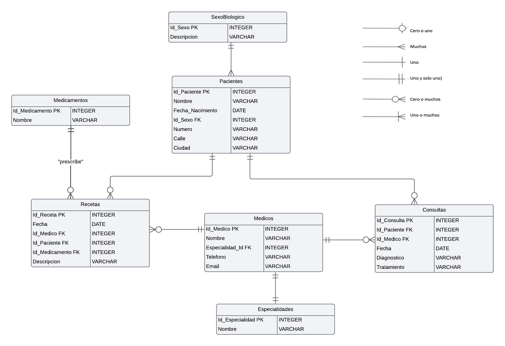

# Parte uno
## 1. ¿Qué tipo de base de datos es?


La base de datos una base de datos relacional. Las bases de datos relacionales se utilizan para almacenar y gestionar datos que están organizados en tablas relacionadas entre sí. En este caso, las entidades (Pacientes, Médicos, Medicamentos, Consultas y Recetas) pueden ser representadas como tablas en una base de datos relacional, con relaciones entre ellas para vincular la información relevante


## 2. Armar el diagrama de entidad relación.


##  3. Considera que la base de datos está normalizada. En caso que no lo esté, ¿cómo podría hacerlo?


Se identificó una inconsistencia en la columna "ciudad" de la tabla de pacientes, donde "Buenos Aires" estaba escrito de diferentes maneras con doble espacios, espacios vacios al principio (por ejemplo, "buenos aires", " Buenos Aires"). Para normalizar los datos, realizamos los siguientes pasos:

1. Identificación de Inconsistencias: Revisamos la columna "ciudad" y encontramos variaciones en la escritura de "Buenos Aires".
2. Corrección de Datos: Ejecutamos una consulta SQL para actualizar todas las variaciones a una forma consistente.

# Parte 2

### 1.  Obtener el nombre y la dirección de los pacientes que viven en Buenos Aires.
```
SELECT nombre, calle
FROM pacientes
WHERE ciudad = 'Buenos Aires';
```


## 2.  Obtener la cantidad de recetas emitidas por cada médico.
```
SELECT m.nombre, COUNT(r.id_receta) AS cantidad_recetas
FROM recetas r
JOIN medicos m ON r.id_medico = m.id_medico
GROUP BY m.nombre;
```


## 3. Obtener el nombre de los pacientes junto con la fecha y el diagnóstico de todas las
consultas médicas realizadas en junio del 2024.


```
SELECT p.nombre, c.fecha, c.diagnostico
FROM consultas c
JOIN pacientes p ON c.id_paciente = p.id_paciente
WHERE c.fecha >= '2024-06-01' AND c.fecha < '2024-07-01';

```


## 4. Obtener el nombre de los medicamentos prescritos más de una vez por el médico
con ID igual a 2.

```
SELECT m.nombre, COUNT(r.id_receta) AS cantidad_prescripciones
FROM recetas r
JOIN medicamentos m ON r.id_medicamento = m.id_medicamento
WHERE r.id_medico = 2
GROUP BY m.nombre
HAVING COUNT(r.id_receta) > 1;
```


## 5. Obtener el nombre de los pacientes junto con la cantidad total de recetas que han
recibido.

```
SELECT p.nombre, COUNT(r.id_receta) AS cantidad_recetas
FROM pacientes p
JOIN recetas r ON p.id_paciente = r.id_paciente
GROUP BY p.nombre;
```


## 6. Obtener el nombre del medicamento más recetado junto con la cantidad de recetas
emitidas para ese medicamento.
```
SELECT m.nombre, COUNT(r.id_receta) AS cantidad_recetas
FROM recetas r
JOIN medicamentos m ON r.id_medicamento = m.id_medicamento
GROUP BY m.nombre
ORDER BY cantidad_recetas DESC
LIMIT 1;
```


## 7. Obtener el nombre del paciente junto con la fecha de su última consulta y el
diagnóstico asociado.
```
SELECT p.nombre, c.fecha, c.diagnostico
FROM pacientes p
JOIN consultas c ON p.id_paciente = c.id_paciente
WHERE c.fecha = (
    SELECT MAX(fecha)
    FROM consultas c2
    WHERE c2.id_paciente = c.id_paciente
);

```


## 8. Obtener el nombre del médico junto con el nombre del paciente y el número total de
consultas realizadas por cada médico para cada paciente, ordenado por médico y
paciente.

```
SELECT m.nombre AS nombre_medico, p.nombre AS nombre_paciente, COUNT(c.id_consulta) AS cantidad_consultas
FROM consultas c
JOIN medicos m ON c.id_medico = m.id_medico
JOIN pacientes p ON c.id_paciente = p.id_paciente
GROUP BY m.nombre, p.nombre
ORDER BY m.nombre, p.nombre;
```


## 9. Obtener el nombre del medicamento junto con el total de recetas prescritas para ese
medicamento, el nombre del médico que lo recetó y el nombre del paciente al que se
le recetó, ordenado por total de recetas en orden descendente.

```
SELECT m.nombre AS nombre_medicamento, 
       COUNT(r.id_receta) AS total_recetas,
       md.nombre AS nombre_medico, 
       p.nombre AS nombre_paciente
FROM recetas r
JOIN medicamentos m ON r.id_medicamento = m.id_medicamento
JOIN medicos md ON r.id_medico = md.id_medico
JOIN pacientes p ON r.id_paciente = p.id_paciente
GROUP BY m.nombre, md.nombre, p.nombre
ORDER BY total_recetas DESC;
```


## 10. Obtener el nombre del médico junto con el total de pacientes a los que ha atendido,
ordenado por el total de pacientes en orden descendente.

```
SELECT md.nombre AS nombre_medico, 
       COUNT(DISTINCT c.id_paciente) AS total_pacientes
FROM consultas c
JOIN medicos md ON c.id_medico = md.id_medico
GROUP BY md.nombre
ORDER BY total_pacientes DESC;

```


